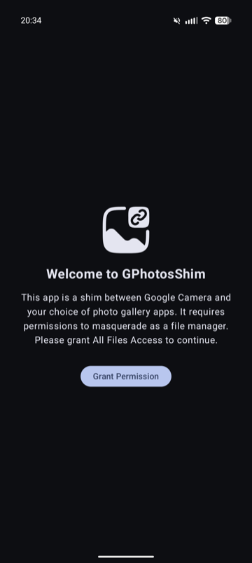
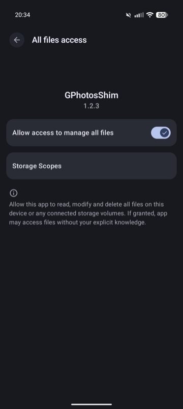
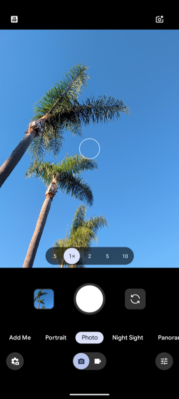
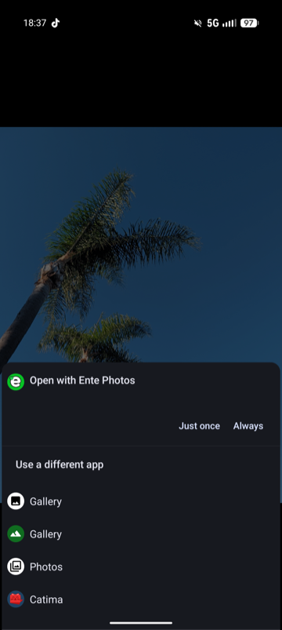

# GPhotosShim

**GPhotosShim** is a lightweight "shim" application that allows you to use an unmodified Google Camera app without having Google Photos installed. It intercepts the request to view an image (when you tap the circular preview thumbnail in the camera) and passes it on to the gallery app of your choice.

## Why is this useful?

This is particularly useful for users on privacy-focused ROMs like **GrapheneOS** who want the superior processing of the Google Camera app but prefer to avoid the Google Photos ecosystem.

By default, Google Camera expects Google Photos to be present to handle image reviews. If it's missing, the review button often does nothing or crashes. GPhotosShim solves this by masquerading as the expected receiver and then forwarding the intent to your preferred local gallery.

### Key Benefits:
*   **Privacy**: Use Google Camera's HDR+ processing without syncing your library to Google.
*   **Choice**: Use your favorite gallery app like **Ente Photos**, **Fossify Gallery**, or **Simple Gallery**.
*   **Seamless Integration**: The "Review" button in Google Camera just works.

## Screenshots

|               Welcome Screen                |              Granting Permissions               |              Google Camera              |               Action Picker               |
|:-------------------------------------------:|:-----------------------------------------------:|:---------------------------------------:|:-----------------------------------------:|
|  |  |  |  |

## How it works

GPhotosShim registers itself to handle `android.provider.action.REVIEW` intents, which is what Google Camera broadcasts. When triggered, it uses a standard Android `ACTION_VIEW` intent to let you choose (and set as default) any gallery app installed on your device.

## Installation & Setup

1. Install the GPhotosShim APK.
2. Open the app and grant the **"All Files Access"** permission. This is required so the shim can provide the gallery app with the necessary URI permissions to view the photo you just took.
3. Open Google Camera and take a photo.
4. Tap the preview circle. When prompted, select your preferred gallery app and tap **"Always"**.

---

Built on other work done by ryosoftware ([here](https://github.com/ryosoftware/GPhotosShim)) and CaramelFur ([here](https://github.com/CaramelFur/GPhotosShim)).
